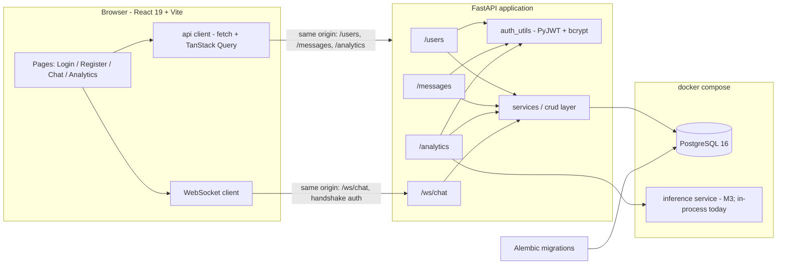

# Chat Analyzer AI

> A full-stack chat application with JWT authentication, real-time messaging over WebSockets, and NLP-powered analytics (per-message sentiment analysis and daily conversation summaries).


**Status:** v0.2 — the core flows work end to end; the repo is mid-refactor towards a
one-command, test-covered, containerised release. See
[Milestones](#milestones--roadmap) for exactly what lands when, and
[`docs/GAPS_AND_IMPROVEMENTS.md`](docs/GAPS_AND_IMPROVEMENTS.md) for the itemised backlog.

---

## Table of contents

- [Overview](#overview)
- [Feature status](#feature-status)
- [Architecture](#architecture)
- [Tech stack](#tech-stack)
- [Repository layout](#repository-layout)
- [Getting started](#getting-started)
- [Definition of shippable](#definition-of-shippable)
- [Environment variables](#environment-variables)
- [Database & migrations](#database--migrations)
- [API reference](#api-reference)
- [WebSocket protocol](#websocket-protocol)
- [Deployment](#deployment)
- [Testing & code quality](#testing--code-quality)
- [Milestones & roadmap](#milestones--roadmap)
- [Documentation](#documentation)
- [Contributing](#contributing)
- [License](#license)

---

## Overview

Chat Analyzer AI is a monorepo containing a REST + WebSocket API and a single-page web
client. Users register, log in, exchange messages, and can run NLP analysis over their
conversation text.

The project is built around four ideas:

1. **A real backend, not a mock.** Passwords are bcrypt-hashed, every mutating endpoint is
   JWT-protected, and the schema is owned by Alembic migrations against PostgreSQL.
2. **Analytics as a first-class feature.** Message text can be scored for sentiment and
   aggregated into a daily summary, so the chat is more than a CRUD demo — and analysis is
   persisted rather than recomputed on every click.
3. **Realtime as a first-class transport.** A WebSocket channel carries new messages to
   every connected client; REST remains the source of truth for history.
4. **A shippable monorepo.** `docker compose up` should give you database, API and web
   client, with migrations applied automatically and a test suite guarding the auth and
   ownership rules.

## Feature status

Legend: ✅ works today · 🟡 works with caveats · 🔨 decided and scheduled, not built yet.

| Area | Feature | Status | Milestone |
| --- | --- | --- | --- |
| Auth | Registration with bcrypt-hashed passwords | ✅ | — |
| Auth | Login → signed JWT (`HS256`, configurable lifetime) | ✅ | lifetime wiring in M1 |
| Auth | Bearer-token guard on protected endpoints | ✅ | — |
| Auth | `GET /users/me` profile lookup | 🟡 returns a user id, not a `UserOut` payload | M1 |
| Auth | Refresh tokens + server-side logout | 🔨 | M4 |
| Chat | Send a message (REST, persisted) | 🟡 API works; the UI composer is currently a no-op | M1 |
| Chat | List messages | 🟡 global list, not scoped per user; no pagination in the UI | M1 |
| Chat | Delete your own message | 🟡 API only, no UI control | M2 |
| Chat | Realtime delivery | 🟡 echo endpoint only: no auth, no persistence, no fan-out | M2 |
| Analytics | Sentiment analysis | 🟡 works, but the model loads at import and results are not stored | M3 |
| Analytics | Daily summary | 🟡 summarises all users; UTC-boundary caveat | M1/M3 |
| Data | Alembic as the single schema owner | 🔨 an alter-style revision plus `create_all()` today | M1 |
| Data | Async database access (`asyncpg` + `AsyncSession`) | 🔨 sync `Session` + `psycopg2` today | M1 |
| Frontend | Login / register / chat / analytics screens, routing, logout | ✅ | — |
| Frontend | Single-origin API access (no CORS, no hard-coded URLs) | 🔨 | M1 |
| Frontend | Protected routes + 401 handling and expiry UX | 🔨 | M2 |
| Frontend | Loading, error and empty states | 🔨 | M2 |
| Ops | Docker Compose stack (`db` + `api` + `web`) | 🔨 | M1 |
| Ops | Backend tests (pytest + httpx) and frontend tests (Vitest) | 🔨 | M1/M2 |
| Ops | CI on every push (lint, tests, migrations) | 🔨 | M1 |

> Every 🟡 and 🔨 row is tracked individually — with file references, impact and the fix — in
> [`docs/GAPS_AND_IMPROVEMENTS.md`](docs/GAPS_AND_IMPROVEMENTS.md). The reasoning behind each
> technology choice is in [`docs/DESIGN_DECISIONS.md`](docs/DESIGN_DECISIONS.md).

## Architecture



Request flow in words:

1. The SPA talks to **one origin**: the Vite dev server proxies to the API in development,
   and in a shipped build FastAPI serves the static bundle itself. That removes CORS from the
   equation entirely (see gap S4).
2. The client stores the JWT and attaches it as `Authorization: Bearer <token>` on every
   request through a single client module (`src/api.ts`).
3. FastAPI validates the token in `auth_utils`, resolves the current user, and hands the route
   an async `AsyncSession` through the `get_db` dependency.
4. Route handlers go through a small service/CRUD layer, so the same message-creation path can
   be reused by the WebSocket handler — which broadcasts the created message to every connected
   client.
5. Analytics endpoints call the NLP layer; scores are computed once and persisted alongside the
   message instead of being recalculated on every request.

## Tech stack

Legend: **in use** today · **M1–M4** the milestone that introduces it · **open** not decided yet.

**Backend**

| Concern | Choice | Status |
| --- | --- | --- |
| Framework | FastAPI, routers split per resource; OpenAPI at `/docs` | in use |
| ORM | SQLAlchemy 2.0 — `AsyncSession` + `asyncpg` | M1 (sync `Session` + `psycopg2` today) |
| Validation | Pydantic v2 (`from_attributes`) | in use |
| Auth | **PyJWT** (`HS256`) + bcrypt password hashing | PyJWT in M1 (`python-jose` today) |
| Database | PostgreSQL 16 — Docker Compose locally, managed instance when hosted | in use |
| Migrations | Alembic as the only writer of DDL | M1 (`create_all()` also runs today) |
| Config | One `pydantic-settings` object reading `.env`, failing fast on missing secrets | M1 (`os.getenv` scattered today) |
| NLP | Distilled summariser + sentiment, lazy-loaded, results persisted | M3 (`bart-large-cnn`, eager, at import today) |
| Packaging | `pyproject.toml` + a single pinned requirements file (`uv` optional) | M1 (two `requirements.txt` files today) |
| Server | Uvicorn | in use |
| Containers | Docker + Docker Compose (`db`, `api`, `web`, eventually `inference`) | M1 |

**Frontend**

| Concern | Choice | Status |
| --- | --- | --- |
| Framework | React 19 + TypeScript 5.8 (strict, `noUnusedLocals`) | in use |
| Build tool | Vite 7 (`@vitejs/plugin-react`) | in use |
| Styling | Tailwind CSS 4 via the `@tailwindcss/vite` plugin | in use |
| Routing | React Router 7 (`BrowserRouter`) | in use |
| HTTP | native `fetch` behind a thin typed client | M2 (axios today) |
| Server state | TanStack Query — caching, retries, invalidation, loading/error state | M2 (`useEffect` + `useState` today) |
| Same-origin access | Vite dev proxy + FastAPI static mount in production | M1 (hard-coded URLs today) |
| Token parsing | `jwt-decode` for UI attribution | in use |
| Lint | ESLint 9 flat config (`typescript-eslint`, react-hooks, react-refresh) | in use |
| Tests | Vitest + React Testing Library + MSW | M2 |

## Repository layout

Entries marked **M1/M2/M3** do not exist yet — they are the structure this repo is moving to.

```
Chat-Analyzer-AI/
├── docker-compose.yml             # M1 — db + api + web (+ inference in M3)
├── docker/
│   ├── api.Dockerfile             # M1
│   ├── web.Dockerfile             # M1 — builds the SPA and serves the static bundle
│   └── inference.Dockerfile       # M3 — only if inference moves out of process
├── pyproject.toml                 # M1 — project metadata + tool config (ruff, pytest)
├── requirements.txt               # M1 — one pinned runtime list (replaces the two today)
├── .env.example                   # template for local configuration
├── alembic/
│   ├── env.py                     # reads DATABASE_URL_SYNC, targets chat_backend.models.Base
│   └── versions/
│       └── 06c1b9c7b0ec_...py     # alter-style today; replaced by a true initial migration in M1
├── alembic.ini
├── chat_backend/                  # FastAPI application package
│   ├── main.py                    # app setup, router registration, SPA static mount (M1)
│   ├── config.py                  # M1 — pydantic-settings: one place for every env var
│   ├── database.py                # async engine, AsyncSession factory, get_db dependency
│   ├── models.py                  # User, Message ORM models
│   ├── schemas.py                 # Pydantic v2 request/response models
│   ├── auth_utils.py              # password hashing, PyJWT encode/decode, get_current_user
│   ├── ai_utils.py                # NLP helpers; lazy-loaded and pushed to M3 packaging
│   ├── crud.py                    # service layer shared by REST and the WebSocket handler
│   └── routes/
│       ├── users.py               # POST /users/register, POST /users/login, GET /users/me
│       ├── messages.py            # POST /messages/, GET /messages/, DELETE /messages/{id}
│       ├── analytics.py           # POST /analytics/sentiment, GET /analytics/daily
│       └── websocket.py           # WS /ws/chat — authenticated, persisted, broadcast (M2)
├── chat_frontend/                 # React + Vite SPA
│   ├── src/
│   │   ├── api.ts                 # one origin, one client, typed helpers
│   │   ├── queries/               # M2 — TanStack Query hooks
│   │   ├── types.ts               # shared TypeScript interfaces (M2: generated from OpenAPI)
│   │   ├── App.tsx                # route table (M2: wrapped in a RequireAuth guard)
│   │   ├── components/            # Navbar, MessageList (extracted from Chat.tsx in M2)
│   │   └── pages/                 # Login, Register, Chat, Analytics
│   ├── index.html
│   ├── vite.config.ts             # M1 — dev proxy for /api, /ws
│   └── package.json
├── tests/                         # M1 — pytest + httpx suite (auth, ownership, users/me)
└── docs/
    ├── DESIGN_DECISIONS.md        # why each technology and pattern is here
    └── GAPS_AND_IMPROVEMENTS.md   # prioritised backlog with file references
```

## Getting started

### Option A — Docker Compose (the M1 target)

> **Not available yet.** This is the entry point M1 delivers; the files are listed in
> [`docs/GAPS_AND_IMPROVEMENTS.md`](docs/GAPS_AND_IMPROVEMENTS.md) (item **O13**). Once it
> lands, a fresh clone is one command:

```bash
git clone https://github.com/zoyaumar/Chat-Analyzer-AI.git
cd Chat-Analyzer-AI
cp .env.example .env          # Windows: copy .env.example .env   (set SECRET_KEY)
docker compose up --build     # -> web on http://localhost:5173, API on http://localhost:8000
```

The compose stack is planned as:

| Service | Image / build | Purpose |
| --- | --- | --- |
| `db` | `postgres:16` | database with a named volume, healthcheck |
| `api` | `docker/api.Dockerfile` | runs `alembic upgrade head` then `uvicorn` |
| `web` | `docker/web.Dockerfile` | builds the SPA and serves it on the same origin |
| `inference` | `docker/inference.Dockerfile` | M3, only if NLP moves out of the API process |

### Option B — run it manually (works today)

**Prerequisites**

| Tool | Version used |
| --- | --- |
| Python | 3.11+ (verified on 3.11.0) |
| Node.js | 20+ (verified on 22.13) |
| npm | 10+ |
| PostgreSQL | any reachable instance — a free Supabase project is what this repo currently points at |

**1. Configure**

```bash
cp .env.example .env        # then fill in DATABASE_URL and SECRET_KEY
```

**2. Backend**

```bash
py -m venv .venv
.venv\Scripts\activate            # macOS/Linux: source .venv/bin/activate
py -m pip install -r chat_backend/requirements.txt

# run from the repository root: the package uses `chat_backend.` imports
uvicorn chat_backend.main:app --reload --port 8000
```

Interactive docs: <http://127.0.0.1:8000/docs> (click **Authorize** and paste the token from
`POST /users/login`). Database check: `curl http://127.0.0.1:8000/test-db`.

**3. Frontend**

```bash
cd chat_frontend
npm install
npm run dev
```

Vite serves the SPA at <http://localhost:5173>. Register a user, log in, and you land on
`/chat`.

> **Known rough edges in the manual path** (all tracked in the gaps document): the composer
> does not send yet (F1), `GET /messages/` is not user-scoped (S2), and `api.ts` still points
> at a hard-coded `http://127.0.0.1:8000`. The M1 work removes all three.

### Useful commands

| Command | Where | Purpose |
| --- | --- | --- |
| `docker compose up --build` | repo root | full stack (M1) |
| `docker compose exec api alembic upgrade head` | repo root | apply migrations inside the stack (M1) |
| `uvicorn chat_backend.main:app --reload --port 8000` | repo root | run the API with autoreload |
| `alembic upgrade head` | repo root | apply migrations |
| `alembic revision --autogenerate -m "add x"` | repo root | generate a migration from model changes |
| `pytest` | repo root | backend tests (M1) |
| `npm run dev` | `chat_frontend/` | Vite dev server with HMR |
| `npm run build` | `chat_frontend/` | type-check (`tsc -b`) + production bundle |
| `npm run lint` | `chat_frontend/` | ESLint over the SPA |
| `npm test` | `chat_frontend/` | Vitest suite (M2) |
| `py -m compileall chat_backend` | repo root | quick syntax check of the backend |

## Definition of shippable

M1 is the milestone that makes this repository something a stranger can run, trust and
deploy. It is done when all of the following are true:

- [ ] `docker compose up` starts `db` + `api` + `web` from a clean clone, with migrations
      applied automatically and no manual steps beyond `.env`.
- [ ] Register → login → send a message → see it in the feed works in the browser.
- [ ] Every read is scoped to the authenticated user (no global message list, no global
      daily summary).
- [ ] The schema is produced by Alembic alone; `alembic upgrade head` succeeds against an
      empty database and `create_all()` no longer runs.
- [ ] The API refuses to start without `SECRET_KEY`, and token lifetime comes from config.
- [ ] One pinned dependency list installs a working environment from scratch.
- [ ] `pytest` covers auth, message ownership, `/users/me` and the analytics scoping rule,
      and passes in CI.
- [ ] `npm run lint && npm run build` pass in CI.
- [ ] The README describes exactly what the code does — no aspirational setup steps.

## Environment variables

| Variable | Required | Default | Description |
| --- | --- | --- | --- |
| `DATABASE_URL` | yes | – | Async SQLAlchemy URL for PostgreSQL, e.g. `postgresql+asyncpg://…` (M1). |
| `DATABASE_URL_SYNC` | no | derived from `DATABASE_URL` | Sync URL (`postgresql+psycopg2://…`) used only by Alembic, which runs migrations outside the async engine (M1). |
| `SECRET_KEY` | yes | – | HMAC key used to sign JWTs. M1 removes the insecure `supersecret` fallback so a missing value fails fast. |
| `ACCESS_TOKEN_EXPIRE_MINUTES` | no | `30` | Token lifetime. Declared in `.env` today but ignored by the code — M1 reads it through the settings object. |
| `DEBUG` | no | `false` | Enables SQL echo and the verbose `/test-db` diagnostics (M1). |
| `AI_SUMMARY_MODEL` | no | `sshleifer/distilbart-cnn-6-6` | Summarisation model (M3, replaces `facebook/bart-large-cnn`). |
| `AI_INFERENCE_URL` | no | – | Base URL of a separate inference service (M3) — only relevant once the packaging decision below is settled. |
| `VITE_API_URL` | no | – | Optional API base URL for the SPA. The dev proxy and the same-origin build mean you normally do not need it (M1). |

Example `.env` for the Docker stack:

```dotenv
DATABASE_URL=postgresql+asyncpg://app:app@db:5432/chat_analyzer
DATABASE_URL_SYNC=postgresql+psycopg2://app:app@db:5432/chat_analyzer
SECRET_KEY=replace-with-a-long-random-string
ACCESS_TOKEN_EXPIRE_MINUTES=30
```

Example `.env` for a hosted Postgres instance such as Supabase (note the driver and TLS
parameters — `asyncpg` takes `ssl=require` in the URL, not a `connect_args` dictionary):

```dotenv
DATABASE_URL=postgresql+asyncpg://postgres.<project-ref>:<password>@<region>.pooler.supabase.com:5432/postgres?ssl=require
DATABASE_URL_SYNC=postgresql+psycopg2://postgres.<project-ref>:<password>@<region>.pooler.supabase.com:5432/postgres?sslmode=require
SECRET_KEY=replace-with-a-long-random-string
```

> **Open decision.** Whether NLP inference stays inside the API process (lazily loaded, small
> model) or moves to its own container/hosted API is the one packaging question still open —
> see **U4** in [`docs/DESIGN_DECISIONS.md`](docs/DESIGN_DECISIONS.md). Everything else about
> the AI layer is already decided: lazy loading, a smaller model, length guards, and persisted
> results.

## Database & migrations

Two tables, declared in `chat_backend/models.py`:

```
users                          messages
─────                          ────────
id            int PK           id         int PK
username      varchar UNIQUE   user_id    int FK -> users.id (not null)
password_hash varchar          text       varchar (not null)
                               timestamp  timestamptz default now()
```

`users 1 ──< messages` (SQLAlchemy `relationship(back_populates=...)`).

```bash
alembic upgrade head                              # apply the schema
alembic revision --autogenerate -m "add x"        # after changing models.py
```

**How the schema is managed (M1):** Alembic is the only thing that writes DDL. The app stops
calling `Base.metadata.create_all()`, the alter-style revision `06c1b9c7b0ec` is replaced by a
true `op.create_table(...)` initial migration, and the `api` container runs
`alembic upgrade head` before starting Uvicorn.

> **Known caveat today.** Because `create_all()` still runs on import and the checked-in
> revision only *alters* existing tables, `alembic upgrade head` fails against a fresh
> database. This is gap **D1/D2** in
> [`docs/GAPS_AND_IMPROVEMENTS.md`](docs/GAPS_AND_IMPROVEMENTS.md) and is fixed in M1 —
> which is also what makes the Compose quickstart possible.

Planned schema follow-ups (M1+): an index on `messages (user_id, timestamp DESC)` for the
feed and the daily-summary query, an explicit `ON DELETE` policy for `user_id`, and
`created_at`/`updated_at` columns.

## API reference

Everything is served from one origin (see [Architecture](#architecture)); the examples below
use `http://127.0.0.1:8000` for the manual setup. Authenticated endpoints expect
`Authorization: Bearer <access_token>`. Browse the generated schema at `/docs` (Swagger UI),
`/redoc`, or `/openapi.json`.

### Users

| Method | Path | Auth | Request | Response |
| --- | --- | --- | --- | --- |
| `POST` | `/users/register` | – | JSON `{ "username": str, "password": str }` | `{ "id": int, "username": str }` |
| `POST` | `/users/login` | – | `application/x-www-form-urlencoded` with `username`, `password` | `{ "access_token": str, "token_type": "bearer" }` |
| `GET` | `/users/me` | Bearer | – | `{ "id": int, "username": str }` |

<details>
<summary>Register</summary>

```bash
curl -X POST http://127.0.0.1:8000/users/register \
  -H "Content-Type: application/json" \
  -d '{"username": "alice", "password": "s3cret"}'
# -> {"id": 1, "username": "alice"}
```

Failure modes: `400 Username already registered`. M1 adds length/regex constraints (gap S6).
</details>

<details>
<summary>Login</summary>

```bash
curl -X POST http://127.0.0.1:8000/users/login \
  -H "Content-Type: application/x-www-form-urlencoded" \
  -d "username=alice&password=s3cret"
# -> {"access_token": "eyJhbGciOi...", "token_type": "bearer"}
```

Failure modes: `401 Invalid username or password`.

The JWT payload is `{ "sub": "<user_id>", "exp": <unix ts> }`; M1 adds `iat`/`jti` so a
revocation list becomes possible later (gaps S7/Q9).
</details>

> `/users/me` currently gets a user id back from `get_current_user` while declaring
> `response_model=UserOut`, so it fails response validation (HTTP 500). Fixed in M1 — gap **B2**.

### Messages

| Method | Path | Auth | Request | Response |
| --- | --- | --- | --- | --- |
| `POST` | `/messages/` | Bearer | JSON `{ "text": str }` — the sender comes from the token | `Message` |
| `GET` | `/messages/` | Bearer (M1; public today) | query `skip`, `limit` | `[Message]` |
| `DELETE` | `/messages/{message_id}` | Bearer | – | `{ "detail": "Message deleted" }` |

`Message` payload:

```json
{ "id": 12, "user_id": 1, "text": "hello world", "timestamp": "2026-02-11T18:03:41.991233+00:00" }
```

<details>
<summary>Send and list</summary>

```bash
TOKEN=$(curl -s -X POST http://127.0.0.1:8000/users/login \
  -d "username=alice&password=s3cret" | jq -r .access_token)

curl -X POST http://127.0.0.1:8000/messages/ \
  -H "Authorization: Bearer $TOKEN" -H "Content-Type: application/json" \
  -d '{"text": "first message"}'

curl "http://127.0.0.1:8000/messages/" -H "Authorization: Bearer $TOKEN"
```

Failure modes: `401` when the token is missing/expired; `404 Message not found or not yours`
when deleting someone else's message.
</details>

Two things change in M1/M2 here:

- `GET /messages/` gains the bearer requirement and a `user_id` filter — today it returns
  **every** user's messages to anyone (gaps **S2**, **B10**).
- The routes declare response models (`MessageOut`), so the contract shows up in OpenAPI
  instead of depending on ORM serialisation (gap **B3**), and the client stops sending a
  `user_id` that the API ignores.

### Analytics

| Method | Path | Auth | Request | Response |
| --- | --- | --- | --- | --- |
| `POST` | `/analytics/sentiment` | Bearer | query parameter `text` | `{ "label": "POSITIVE"\|"NEGATIVE", "score": float }` |
| `GET` | `/analytics/daily` | Bearer | – | `{ "date": "YYYY-MM-DD", "summary": str }` |

```bash
curl -X POST "http://127.0.0.1:8000/analytics/sentiment?text=I%20love%20this" \
  -H "Authorization: Bearer $TOKEN"
# -> {"label": "POSITIVE", "score": 0.9998}

curl http://127.0.0.1:8000/analytics/daily -H "Authorization: Bearer $TOKEN"
# -> {"date": "2026-02-11", "summary": "..."}
```

Scheduled changes (M1/M3):

- Sentiment takes its text as a **query parameter** today; M1 moves it into a JSON body
  (gap **B4**).
- `/analytics/daily` is not user-scoped — it currently summarises *everyone's* messages for
  the day. Scoping it is M1 (gap **S3**); the summarisation quality work (chunking, distilled
  model, persisted scores) is M3 (gaps **A1/A2/D7**).
- The first analytics request after a restart is slow because `ai_utils` loads the models at
  import time; M3 makes loading lazy and keeps the API bootable without them (gap **B5/A6**).

### Utility

| Method | Path | Auth | Response |
| --- | --- | --- | --- |
| `GET` | `/` | – | `{ "message": "Welcome to Chat Analyzer API with AI!" }` |
| `GET` | `/test-db` | – | `{ "db_result": 1 }` — proves the app can reach PostgreSQL |

M1 replaces `/test-db` with a proper `/health` (liveness) and `/health/ready` (database plus
model readiness) pair, and hides the verbose diagnostics behind `DEBUG` (gaps **B8**, **O5**).

## WebSocket protocol

| Item | Value |
| --- | --- |
| Endpoint | `WS /ws/chat` (same origin — the Vite dev proxy forwards `/ws`) |
| Auth | handshake validation, then the token in the first frame (decided; see below) |
| Client → server | `{ "text": "..." }` for a new message, `{ "type": "ping" }` for keepalive |
| Server → all clients | the created `Message` as JSON |

```ts
// chat_frontend/src/api.ts — target shape (M2)
const ws = new WebSocket(`${location.origin.replace(/^http/, "ws")}/ws/chat`);
ws.onopen = () => ws.send(JSON.stringify({ type: "auth", token }));
```

Where it stands today, stated plainly:

- ✅ A connection is accepted and text frames are echoed back — enough to prove the transport.
- ⬜ The JWT check exists only as commented-out code, so the socket is effectively public
  (gap **S1**).
- ⬜ Messages are neither persisted nor broadcast (`ConnectionManager.broadcast` is defined but
  unused), so it is not yet a chat channel (gap **B1**).
- ⬜ The server sends plain text while the client runs `JSON.parse(event.data)`, which throws
  on every frame (gap **F3**).
- ⬜ The token currently travels in the query string (`?token=`), which puts a credential in
  access logs and browser history (gap **S8**).

**This endpoint is deliberately kept, not deleted** — realtime delivery is a first-class part
of the product, and M2 finishes it: authenticate at handshake, move the token out of the URL
into the first frame, persist through the same service layer REST uses, broadcast JSON, and add
client-side reconnect with backoff. The reasoning is recorded in
[`docs/DESIGN_DECISIONS.md`](docs/DESIGN_DECISIONS.md) (Q16, Q41).

Target protocol once M2 lands:

```jsonc
// client -> server
{ "type": "auth", "token": "<jwt>" }
{ "text": "hello" }

// server -> every connected client
{ "id": 13, "user_id": 1, "text": "hello", "timestamp": "2026-02-11T18:03:41Z" }
```

## Deployment

Containers are the deployment unit. The repo intentionally does **not** ship a
platform-specific blueprint any more: the previous `render.yaml` pointed at a module path that
does not exist and installed an incomplete dependency list, and pinning the project to one
provider's YAML was more friction than value (see `docs/DESIGN_DECISIONS.md` Q32/Q41). A
Docker image is a portable contract — the same artefact runs locally, in CI and on any host.

Planned deployment shape (M1):

```
client ──TLS──> reverse proxy ──> web (SPA assets)      # or api serves the bundle itself
                              └─> api (uvicorn)  ──> db (PostgreSQL)
                                     └─ migrations on start: alembic upgrade head
```

Requirements for any host:

| Requirement | Notes |
| --- | --- |
| PostgreSQL 16 (or a managed equivalent) | Only the API talks to it; `DATABASE_URL_SYNC` is used by migrations. |
| `SECRET_KEY` | Injected as a secret; the app refuses to start without it (M1). |
| Environment variables | See [Environment variables](#environment-variables); nothing is baked into the image. |
| TLS termination | Any reverse proxy or load balancer; the API itself speaks plain HTTP. |
| Health probes | `/health` (liveness) and `/health/ready` (database + model readiness) in M1. |
| Persistent volume | Only if the NLP model cache lives in the container (M3 packaging decision). |

With the free-tier PaaS path gone for now, a single small VPS or any container host with
Compose installed is enough: `docker compose up -d --build`.

## Testing & code quality

| Check | Command | Status |
| --- | --- | --- |
| Frontend type-check + build | `cd chat_frontend && npm run build` | ✅ passes (`tsc -b && vite build`) |
| Frontend lint | `cd chat_frontend && npm run lint` | ✅ clean (`eslint .`, exit code 0) |
| Backend syntax | `py -m compileall chat_backend alembic` | ✅ passes |
| Backend tests | `pytest` | 🔨 M1 |
| Frontend tests | `cd chat_frontend && npm test` | 🔨 M2 |
| Migrations against an empty database | `alembic upgrade head` | 🔨 M1 |
| Backend lint/format + types | `ruff check`, `mypy` | 🔨 M1 |
| CI (all of the above on every push) | GitHub Actions | 🔨 M1 |

**Planned test stack.**

- **Backend:** `pytest` + `pytest-asyncio` with `httpx.ASGITransport` against the FastAPI app
  (no live server needed), a PostgreSQL service in CI, and a fixture that wraps each test in a
  transaction and rolls it back. `get_db` is overridden in tests, and the NLP layer is
  monkeypatched so no model weights are downloaded during a test run.
- First cases to write, chosen because they would have caught the bugs found in review:
  register/login happy path and duplicate username; `GET /users/me` returns a profile;
  `GET /messages/` requires a token and returns only the caller's messages; deleting another
  user's message is a 404; `/analytics/daily` ignores other users' rows; the WebSocket rejects a
  connection without a valid token.
- **Frontend:** Vitest + React Testing Library with MSW for the API, covering the login flow
  (token stored, redirect to `/chat`), the composer (typing + clicking Send issues exactly one
  `POST /messages/`), and the `RequireAuth` guard.

## Milestones & roadmap

The backlog is ordered into milestones so that "shippable" has a definition instead of a vibe.

**M1 — Shippable core** (goal: a stranger can clone it, run it and trust it)

| Work | Gaps |
| --- | --- |
| Migrate to async SQLAlchemy (`asyncpg`, `AsyncSession`, async `get_db`) | B13 |
| Single origin: Vite dev proxy + FastAPI static mount; drop the CORS wildcard | S4, F2, F15 |
| Fix the composer so Send actually posts | F1 |
| Scope messages and the daily summary to the authenticated user | S2, S3 |
| Fix `/users/me` and the `get_current_user` contract | B2 |
| Replace `python-jose` with `PyJWT`; add `iat`/`jti` | B14, S7 |
| Alembic as the only schema owner; real initial migration; remove `create_all()` | D1, D2, B9, D11 |
| One settings object; fail fast without `SECRET_KEY`; honour token lifetime | B6, S5 |
| One pinned dependency list + `pyproject.toml` + `ruff`/`mypy` | D8, T3, T4, A5 |
| Docker + Compose (`db`, `api`, `web`) with migrations on start | O13 |
| Backend tests for auth, ownership and `/users/me`; CI on every push | T1, T5, O6 |
| `/health` + `/health/ready`; retire the public `/test-db` diagnostics | B8, O5 |

**M2 — Realtime as a first-class channel**

| Work | Gaps |
| --- | --- |
| WebSocket: authenticated handshake; move the token out of the query string | S1, S8 |
| Persist socket messages through the service layer and broadcast JSON | B1, B12 |
| Client: reconnect with backoff, de-duplication, connection state, defensive parsing | F3, F11 |
| Protected routes, 401 interceptor, expiry UX, `AuthProvider` | F4, F5, Q29 |
| `fetch` client + TanStack Query for loading/error/empty states | F9, F14, F16 |
| Pagination ("load older") and delete-message UI | F6, B10 |
| Frontend tests (Vitest + RTL + MSW) | T2 |

**M3 — AI, done right**

| Work | Gaps |
| --- | --- |
| Settle the inference packaging (U4) and lazy-load a small model | B5, A1, A6 |
| Chunked map-reduce summarisation, length guards, 4xx instead of 500 | A2 |
| Persist sentiment per message at write time; make analytics a lookup | A4, D7 |
| Pin model revisions and record model name/version with each result | A7 |
| Analytics dashboard with sentiment trends and volume charts | P12 |

**M4 — Hardening and product polish**

| Work | Gaps |
| --- | --- |
| Refresh tokens, server-side logout, `HttpOnly` cookie session | S7, Q5, Q9 |
| Password/username policy, rate limiting on login and register | S6 |
| Tailwind design tokens, shared UI primitives, accessibility pass | F12 |
| Types generated from OpenAPI; delete dead files and template leftovers | F13, F7, F8 |
| Redis pub/sub (or `LISTEN/NOTIFY`) for multi-instance fan-out | Q18 |
| Feature work: rooms/DMs, presence, typing indicators, read receipts, search, attachments | P1–P15 |

## Documentation

| Document | Contents |
| --- | --- |
| [`docs/GAPS_AND_IMPROVEMENTS.md`](docs/GAPS_AND_IMPROVEMENTS.md) | Every known bug, missing feature and improvement, prioritised, with file references and the decision that closed it |
| [`docs/DESIGN_DECISIONS.md`](docs/DESIGN_DECISIONS.md) | "Why am I using X?" / "Should I use Y instead?" — the rationale, the alternatives and where each decision stands, plus the review dissent log |
| [`chat_frontend/README.md`](chat_frontend/README.md) | Frontend-specific setup notes and source map |

## Contributing

1. Branch from `main` (`git checkout -b feature/short-description`).
2. Keep the conventions: routers under `chat_backend/routes/`, Pydantic schemas in
   `schemas.py`, shared queries in `crud.py`, HTTP calls centralised in `src/api.ts`, Tailwind
   utility classes inline.
3. Run the checks before opening a PR:

   ```bash
   py -m compileall chat_backend
   pytest                                   # M1
   cd chat_frontend && npm run lint && npm run build && npm test
   ```

4. Any model change ships with an Alembic revision that works against an empty database.
5. Describe the change and any follow-up work in the PR body.

Commit messages here are short and imperative (`Websockets`, `front end config`,
`Delete message endpoint`) — keeping that style makes the history easy to skim.

## License

No license file exists in this repository yet, so all rights reserved by the author. Add a
`LICENSE` (MIT and Apache-2.0 are the usual choices) before accepting external contributions.

