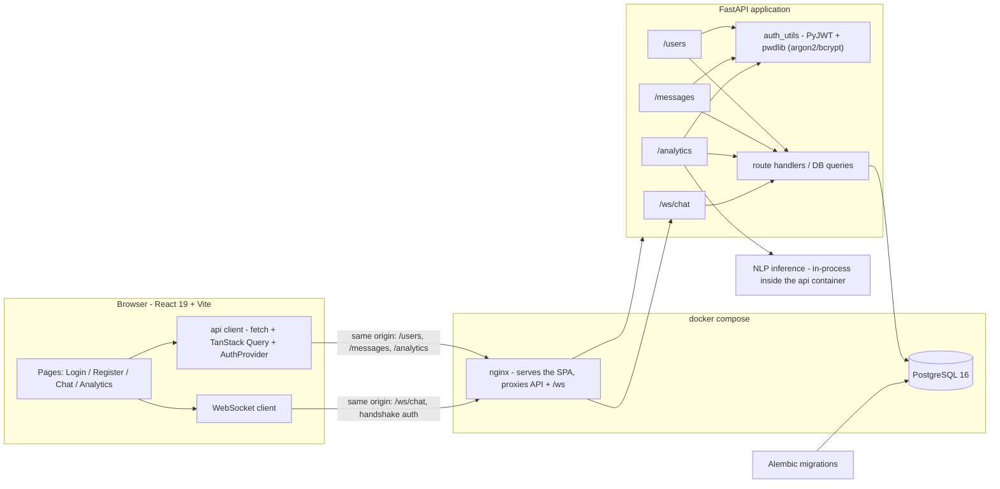

# Chat Analyzer AI

> A full-stack chat application with JWT authentication, real-time messaging over WebSockets, and NLP-powered analytics (per-message sentiment analysis and daily conversation summaries).


**Status:** v0.2 — the core flows work end to end: auth, realtime chat, persistence and NLP
analytics, containerised and test-covered (135 backend / 90 frontend tests). See
[Milestones](#milestones--roadmap) for what is done and what comes next.

---

## Table of contents

- [Overview](#overview)
- [Feature status](#feature-status)
- [Architecture](#architecture)
- [Tech stack](#tech-stack)
- [Repository layout](#repository-layout)
- [Getting started](#getting-started)
- [Definition of shippable](#definition-of-shippable)
- [Environment variables](#environment-variables)
- [Database & migrations](#database--migrations)
- [API reference](#api-reference) — full reference in [`docs/api-reference.md`](docs/api-reference.md)
- [Deployment](#deployment) — including [single-process scaling](#scaling-one-process-deliberately)
- [Testing & code quality](#testing--code-quality)
- [Milestones & roadmap](#milestones--roadmap)
- [Contributing](#contributing)
- [License](#license)

---

## Overview

Chat Analyzer AI is a monorepo containing a REST + WebSocket API and a single-page web
client. Users register, log in, exchange messages, and can run NLP analysis over their
conversation text.

The project is built around four ideas:

1. **A real backend, not a mock.** Passwords are argon2id-hashed (bcrypt hashes written before
   the migration still verify), every mutating endpoint is
   JWT-protected, and the schema is owned by Alembic migrations against PostgreSQL.
2. **Analytics as a first-class feature.** Message text can be scored for sentiment and
   aggregated into a daily summary, so the chat is more than a CRUD demo — and analysis is
   persisted rather than recomputed on every click.
3. **Realtime as a first-class transport.** A WebSocket channel persists and pushes new messages
   to every open socket belonging to the message's author; REST remains the source of truth for
   history.
4. **A shippable monorepo.** `docker compose up` gives you database, API and web
   client, with migrations applied automatically and a test suite guarding the auth and
   ownership rules.

## Feature status

Legend: ✅ works today · 🟡 works with caveats · 🔨 decided and scheduled, not built yet.

| Area | Feature | Status |
| --- | --- | --- |
| Auth | Registration with argon2id-hashed passwords (legacy bcrypt rehashed on login) | ✅ |
| Auth | Login → signed JWT (HS256, `PyJWT`, configurable lifetime) | ✅ |
| Auth | Bearer-token guard on protected endpoints | ✅ |
| Auth | `GET /users/me` profile lookup | ✅ |
| Auth | `GET /users/{user_id}` public profile (id, username, `created_at`) | ✅ |
| Auth | Account deletion (`DELETE /users/me`, messages cascade) | ✅ |
| Auth | Refresh tokens + server-side logout (rotating, hashed, `HttpOnly` cookie) | ✅ |
| Chat | Send a message (REST, persisted) | ✅ |
| Chat | List messages | ✅ auth-required, user-scoped, bounded keyset API with load-older UI |
| Chat | Delete your own message | ✅ owner-only control; confirmed deletion is removed from the feed |
| Chat | Author names in the feed (`GET /users/{user_id}`, cached per author, initials badge) | ✅ |
| Chat | Realtime delivery | ✅ authenticated (first-frame JWT), persisted via the shared service layer, fanned out to every connected socket of the author |
| Analytics | Sentiment analysis | ✅ scored once at write time and stored per message; ad-hoc repeats answered from a cache |
| Analytics | Daily summary | ✅ user-scoped UTC day window, chunked map-reduce summarisation, smaller pinned model |
| Analytics | Sentiment timeline (`GET /analytics/sentiment/timeline?days=N`) | ✅ daily counts and mean score, read from stored results |
| Analytics | Trend dashboard (7/30/90-day window, SVG chart + data table) | ✅ loads on its own; a pure SQL read, so it runs no inference |
| Data | Alembic as the single schema owner | ✅ real initial migration; `create_all()` removed; `alembic check` reports no drift |
| Data | Async database access (`asyncpg` + `AsyncSession`) | ✅ |
| Frontend | Login / register / chat / analytics screens, routing, logout | ✅ |
| Frontend | Single-origin API access (no CORS, no hard-coded URLs) | ✅ |
| Frontend | Protected routes + 401 handling and expiry UX | ✅ |
| Frontend | Loading, error and empty states | ✅ |
| Frontend | Visible keyboard focus, labelled feed, narrow-screen layout | ✅ |
| Ops | Docker Compose stack (`db` + `api` + `web`) | ✅ |
| Ops | Single-process pin with a startup worker-count guard | ✅ `--workers 1`; a misconfigured deploy logs an `ERROR` at boot |
| Ops | Backend tests (pytest + httpx) and frontend tests (Vitest) | ✅ |
| Ops | CI on every push (lint, type-check, migrations, tests, `npm audit`) | ✅ |
| Ops | Dependency updates and CVE scanning (Dependabot + `pip-audit`) | ✅ |

## Architecture


```mermaid
flowchart LR
    subgraph Browser["Browser - React 19 + Vite"]
        UI["Pages: Login / Register / Chat / Analytics"]
        CL["api client - fetch + TanStack Query + AuthProvider"]
        WSC["WebSocket client"]
    end

    subgraph API["FastAPI application"]
        R_USERS["/users"]
        R_MSG["/messages"]
        R_ANA["/analytics"]
        R_WS["/ws/chat"]
        AUTH["auth_utils - PyJWT + pwdlib (argon2/bcrypt)"]
        ROUTES["route handlers / DB queries"]
    end

    subgraph Compose["docker compose"]
        DB[("PostgreSQL 16")]
        WEB["nginx - serves the SPA, proxies API + /ws"]
    end

    ALEMBIC["Alembic migrations"]
    INF["NLP inference - in-process inside the api container"]

    UI --> CL
    UI --> WSC
    CL -- "same origin: /users, /messages, /analytics" --> WEB
    WSC -- "same origin: /ws/chat, handshake auth" --> WEB
    WEB --> API
    WEB --> R_WS
    R_USERS --> AUTH
    R_MSG --> AUTH
    R_ANA --> AUTH
    R_USERS --> ROUTES
    R_MSG --> ROUTES
    R_ANA --> ROUTES
    ROUTES --> DB
    R_WS --> ROUTES
    R_ANA --> INF
    ALEMBIC --> DB
```

Request flow in words:

1. The SPA talks to **one origin**: the Vite dev server proxies to the API in development,
   and in the shipped Docker stack nginx serves the SPA and proxies API/WebSocket traffic. That
   removes CORS from the equation entirely.
2. The client stores the JWT and attaches it as `Authorization: Bearer <token>` on every
   request through the typed `fetch` wrapper (`src/apiClient.ts`).
3. Pages read server state through TanStack Query hooks in `src/queries/`: one cache and one
   query-key convention, retries for network failures, and mutations that write the cached feed
   directly instead of refetching it.
4. `POST /users/register` is checked against the credential policy, and both credential endpoints
   pass a per-client rate limit *before* anything is hashed or verified (`ratelimit.py`).
5. FastAPI validates the token in `auth_utils`, resolves the current user, and hands the route
   an async `AsyncSession` through the `get_db` dependency.
6. Route handlers and WebSocket messages persist through a shared `crud.py` service layer (`create_message`, `get_messages_for_user`, `delete_message`). Both REST and WebSocket operations write messages identically and broadcast realtime frames via `realtime.manager.send_to_user`.
7. Analytics endpoints read the NLP layer's persisted results instead of recomputing them: each
   message is scored once at write time into `message_sentiment`, and the summary and timeline
   aggregate from there.

## Tech stack

**Backend**

| Concern | Choice | Status |
| --- | --- | --- |
| Framework | FastAPI, routers split per resource; OpenAPI at `/docs` | in use |
| ORM | SQLAlchemy 2.0 — `AsyncSession` + `asyncpg` | in use |
| Validation | Pydantic v2 (`from_attributes`) | in use |
| Auth | **PyJWT** (`HS256`) + argon2id password hashing via `pwdlib` (bcrypt verifies legacy hashes) | in use |
| Database | PostgreSQL 16 in Docker Compose, with a managed database optional for hosting | in use |
| Migrations | Alembic as the only writer of DDL | in use (`create_all()` removed) |
| Config | One `pydantic-settings` object reading `.env`, failing fast on missing secrets | in use |
| NLP | Distilled summariser + sentiment, warmed at boot in Compose, results persisted | in use |
| Packaging | `pyproject.toml` + a single pinned requirements file (`uv` optional) | in use |
| Server | Uvicorn | in use |
| Containers | Docker + Docker Compose (`db`, `api`, `web`) | in use |

**Frontend**

| Concern | Choice | Status |
| --- | --- | --- |
| Framework | React 19 + TypeScript 5.8 (strict, `noUnusedLocals`) | in use |
| Build tool | Vite 7 (`@vitejs/plugin-react`) | in use |
| Styling | Tailwind CSS 4 via the `@tailwindcss/vite` plugin | in use |
| Routing | React Router 7 (`BrowserRouter`) | in use |
| HTTP | native `fetch` behind a typed client (`src/apiClient.ts`); axios removed | in use |
| Server state | TanStack Query 5 (`src/queries/`) — cache, retries, mutations, loading/error state | in use |
| Same-origin access | Vite dev proxy + nginx `web` container in production | in use (hard-coded URLs removed) |
| Token parsing | `jwt-decode` for UI attribution | in use |
| Lint | ESLint 9 flat config (`typescript-eslint`, react-hooks, react-refresh) | in use |
| Tests | Vitest + React Testing Library + MSW | in use (90 tests: auth, auth forms, chat UI, realtime socket hook, wire protocol, analytics + trend dashboard, `fetch` client, query policy, MSW page-level, axe accessibility) |

## Repository layout

The layout as it stands today:

```
Chat-Analyzer-AI/
├── docker-compose.yml             # db + api + web, one published port (8080)
├── docker/
│   ├── api.Dockerfile             # migrations on start, then uvicorn
│   ├── web.Dockerfile             # builds the SPA, serves it through nginx
│   └── nginx.conf                 # SPA fallback, API/WS proxy, security headers
├── pyproject.toml                 # project metadata + tool config (ruff, pytest, mypy)
├── requirements.txt               # one pinned runtime list
├── .env.example                   # template for local configuration
├── .github/
│   ├── dependabot.yml             # weekly pip/npm/actions updates
│   └── workflows/ci.yml           # lint, type-check, audit, migrations, tests
├── alembic/
│   ├── env.py                     # async template, targets chat_backend.models.Base
│   └── versions/
│       ├── 06c1b9c7b0ec_...py     # true initial migration (users, messages)
│       ├── 1a2b3c4d5e6f_...py     # message query indexes
│       ├── f4e5d6c7b8a9_...py     # cap Message.text at 4000, cascade user deletion
│       ├── b7c8d9e0f1a2_...py     # row timestamps + message_sentiment
│       ├── c8d9e0f1a2b3_...py     # drop the redundant unique constraint on username
│       └── d3f7a1c9e2b4_...py     # refresh_tokens table (revocable sessions)
├── alembic.ini
├── chat_backend/                  # FastAPI application package
│   ├── main.py                    # app setup, router registration, health probes
│   ├── config.py                  # pydantic-settings: one place for every env var
│   ├── database.py                # async engine, AsyncSession factory, get_db dependency
│   ├── models.py                  # User, Message, MessageSentiment, RefreshToken
│   ├── schemas.py                 # Pydantic v2 request/response models
│   ├── auth_utils.py              # password hashing, PyJWT encode/decode, get_current_user
│   ├── ai_utils.py                # lazy pinned pipelines, chunking, caching, model status
│   ├── crud.py                    # service layer shared by REST and the WebSocket handler
│   ├── realtime.py                # wire frames + the per-user connection registry
│   ├── ratelimit.py               # per-client sliding-window limiters + FastAPI dependencies
│   ├── scaling.py                 # single-process guard: worker count, loud boot-time warning
│   ├── observability.py           # JSON-lines logging + X-Request-ID middleware
│   └── routes/
│       ├── users.py               # register, login, refresh, logout, /users/me, /users/{id}, delete me
│       ├── messages.py            # POST /messages/, GET /messages/, DELETE /messages/{id}
│       ├── analytics.py           # sentiment, daily summary, sentiment timeline
│       └── websocket.py           # WS /ws/chat — authenticated, persisted, broadcast
├── chat_frontend/                 # React + Vite SPA
│   ├── src/
│   │   ├── api.ts                 # endpoint wrappers (plain data), incl. GET /users/{id}
│   │   ├── apiClient.ts           # typed fetch client: bearer token, query params, ApiError
│   │   ├── realtime/              # useChatSocket + protocol: first-frame auth, heartbeat, reconnect
│   │   ├── queries/               # query keys, client policy, message/analytics/user hooks
│   │   ├── test/                  # Vitest setup, QueryClient render helper, MSW handlers
│   │   ├── types.ts               # shared TypeScript interfaces
│   │   ├── index.css              # Tailwind entry + the shared `.focus-ring` class
│   │   ├── auth/                  # AuthProvider, RequireAuth, token helpers
│   │   ├── components/            # Navbar, MessageList (author names + initials)
│   │   ├── pages/                 # Login, Register, Chat, Analytics
│   │   └── App.tsx                # BrowserRouter + protected route table
│   ├── index.html
│   ├── vite.config.ts             # dev proxy for the API and /ws, Vitest config
│   ├── package.json
│   └── README.md                  # frontend setup, source map and auth notes
└── tests/                         # pytest + httpx suite (auth, limits, chat, analytics, AI, ops)
```

## Getting started

### Option A — Docker Compose (recommended)

```bash
git clone https://github.com/zoyaumar/Chat-Analyzer-AI.git
cd Chat-Analyzer-AI
cp .env.example .env          # Windows: copy .env.example .env   (set SECRET_KEY)
docker compose up --build     # -> the whole app on http://localhost:8080
```

Three services, one published port:

| Service | Image / build | Purpose |
| --- | --- | --- |
| `db` | `postgres:16` | database with a named volume and a healthcheck |
| `api` | `docker/api.Dockerfile` | runs `alembic upgrade head`, then `uvicorn`; not published — only `web` reaches it |
| `web` | `docker/web.Dockerfile` | builds the SPA and serves it through nginx on `:8080`, proxying the API and `/ws` |

The browser therefore talks to one origin and there is no CORS configuration to get wrong.

> NLP inference runs inside the `api` container, which holds both models in memory. Compose sets
> `AI_WARMUP_ON_STARTUP=true` and mounts a named volume at `HF_HOME`, so weights are downloaded once
> and loaded at container start rather than on the first user request; the model-backed `api` memory
> limit is `2g` from a measured ~1.2 GB peak. Outside Compose the models load lazily on first use.
> Splitting inference into its own container — or calling a hosted API — remains an open packaging
> decision; pinned models, warmed loads and persisted results are already settled.

### Option B — run the two halves directly (no Docker)

**Prerequisites**

| Tool | Version used |
| --- | --- |
| Python | 3.11+ (verified on 3.11.0) |
| Node.js | 20+ (verified on 22.13) |
| npm | 10+ |
| PostgreSQL | any reachable instance — the Compose `db` service, a local container on `5433` for tests, or a hosted instance such as Supabase |

**1. Configure**

```bash
cp .env.example .env        # then fill in DATABASE_URL and SECRET_KEY
```

**2. Backend**

```bash
py -m venv .venv
.venv\Scripts\activate            # macOS/Linux: source .venv/bin/activate
py -m pip install -r requirements.txt

# run from the repository root: the package uses `chat_backend.` imports
uvicorn chat_backend.main:app --reload --port 8000
```

Interactive docs: <http://127.0.0.1:8000/docs> (click **Authorize** and paste the token from
`POST /users/login`). Readiness check: `curl http://127.0.0.1:8000/health/ready`.

**3. Frontend**

```bash
cd chat_frontend
npm install
npm run dev
```

Vite serves the SPA at <http://localhost:5173>. Register a user, log in, and you land on
`/chat`.

> **Current frontend auth path:** the SPA uses the Vite proxy in development and nginx in
> production; `AuthProvider` owns the token, guards private routes and handles expiry/401s.

### Useful commands

| Command | Where | Purpose |
| --- | --- | --- |
| `docker compose up --build` | repo root | full stack |
| `docker compose exec api alembic upgrade head` | repo root | apply migrations inside the stack |
| `uvicorn chat_backend.main:app --reload --port 8000` | repo root | run the API with autoreload |
| `alembic upgrade head` | repo root | apply migrations |
| `alembic check` | repo root | fail if the models and the migrations have drifted apart |
| `alembic revision --autogenerate -m "add x"` | repo root | generate a migration from model changes |
| `pytest` | repo root | backend tests |
| `RUN_AI_EVAL=1 pytest tests/test_ai_eval.py` | repo root | opt-in accuracy check on the pinned models — downloads the weights, fails if a model no longer clears the floor |
| `python -m pip_audit` | repo root | report known advisories in the installed Python packages |
| `npm run dev` | `chat_frontend/` | Vite dev server with HMR |
| `npm run build` | `chat_frontend/` | type-check (`tsc -b`) + production bundle |
| `npm run lint` | `chat_frontend/` | ESLint over the SPA |
| `npm audit --omit=dev --audit-level=high` | `chat_frontend/` | CVE gate for the production dependency tree |
| `npm test` | `chat_frontend/` | Vitest suite (90 tests across 13 files: auth, auth forms, chat UI, realtime socket hook, wire protocol, analytics + trend dashboard, `fetch` client, query policy, attribution, MSW page-level, CSP baseline, axe accessibility audits) |
| `py -m compileall chat_backend` | repo root | quick syntax check of the backend |

## Definition of shippable

The bar for "shippable" is the milestone that makes this repository something a stranger can
run, trust and deploy. All of the following are true today:

- [x] `docker compose up` starts `db` + `api` + `web` from a clean clone, with migrations
      applied automatically and no manual steps beyond `.env`.
- [x] Register → login → send a message → see it in the feed works in the browser.
- [x] Every read is scoped to the authenticated user (no global message list, no global
      daily summary).
- [x] The schema is produced by Alembic alone in application startup; `alembic upgrade head`
      succeeds against an empty database and application code does not call `create_all()`.
- [x] The API refuses to start without `SECRET_KEY`, and token lifetime comes from config.
- [x] Registration enforces a credential policy and the endpoints that mint or create an identity
      are rate-limited per client address.
- [x] One pinned dependency list installs a working environment from scratch.
- [x] `pytest` covers auth, message ownership, `/users/me` and the analytics scoping rule,
      and passes in CI.
- [x] `npm run lint && npm run build` pass in CI.
- [x] Every setup command and curl example here has been run against this code, so a step that
      fails is a step the tests would have caught. The claim is not that the README is exhaustive —
      it is that nothing in it is aspirational. Anything unbuilt is labelled 🔨 or ⬜ above.

## Environment variables

| Variable | Required | Default | Description |
| --- | --- | --- | --- |
| `DATABASE_URL` | yes | – | Async SQLAlchemy URL for PostgreSQL, e.g. `postgresql+asyncpg://…`. |
| `DATABASE_URL_SYNC` | no | derived from `DATABASE_URL` | Sync URL (`postgresql+psycopg://…`) used only by Alembic, which runs migrations outside the async engine. |
| `SECRET_KEY` | yes | – | HMAC key used to sign JWTs. There is no insecure fallback; startup fails when it is missing. |
| `ACCESS_TOKEN_EXPIRE_MINUTES` | no | `30` | Access-token lifetime, read through the settings object. |
| `REFRESH_TOKEN_EXPIRE_DAYS` | no | `14` | Refresh-token lifetime in days — the rotating, revocable half of the session; renewed on every refresh. |
| `REFRESH_COOKIE_SECURE` | no | `false` | Sets `Secure` on the refresh cookie; flip on behind TLS, off for plain-HTTP local dev. `HttpOnly` and `SameSite=Strict` are unconditional. |
| `DEBUG` | no | `false` | Sets the JSON log level to DEBUG, which is otherwise the quietest useful setting. |
| `DB_POOL_SIZE` | no | `5` | Base async SQLAlchemy pool size. |
| `DB_MAX_OVERFLOW` | no | `10` | Connections allowed beyond `DB_POOL_SIZE` before the pool blocks. |
| `DB_POOL_TIMEOUT` | no | `30` | Seconds to wait for a pooled connection before failing. |
| `DB_POOL_RECYCLE` | no | `1800` | Seconds before an idle connection is recycled, ahead of a pooler dropping it. |
| `AI_SENTIMENT_MODEL` | no | `distilbert-base-uncased-finetuned-sst-2-english` | Sentiment model. |
| `AI_SENTIMENT_REVISION` | no | pinned 40-char SHA | Exact upstream revision of the sentiment model; empty means "follow the main branch". |
| `AI_SUMMARY_MODEL` | no | `sshleifer/distilbart-cnn-6-6` | Summarisation model (replaces `facebook/bart-large-cnn`). |
| `AI_SUMMARY_REVISION` | no | pinned 40-char SHA | Exact upstream revision of the summary model; empty means "follow the main branch". |
| `AI_WARMUP_ON_STARTUP` | no | `false` (`true` in Compose) | Load both models at container start rather than on the first request, so the download and init do not sit on a user request. Best-effort — failures are reported by `/health/ready`, never fatal. |
| `API_MEMORY_LIMIT` | no | `2g` | Memory limit for the Compose `api` service, which holds both models plus torch. Set from a measured ~1.2 GB peak with headroom. |
| `LOGIN_RATE_LIMIT` | no | `10` | Login attempts allowed per client address per window before a `429`. |
| `LOGIN_RATE_WINDOW_SECONDS` | no | `300` | Length of that window, in seconds. |
| `REGISTER_RATE_LIMIT` | no | `5` | Registrations allowed per client address per window. |
| `REGISTER_RATE_WINDOW_SECONDS` | no | `3600` | Length of that window, in seconds. |
| `VITE_DEV_API_TARGET` | no | `http://127.0.0.1:8000` | Optional Vite dev-proxy target for the API. The browser still uses same-origin relative URLs. |

Example `.env` for the Docker stack:

```dotenv
DATABASE_URL=postgresql+asyncpg://app:app@db:5432/chat_analyzer
DATABASE_URL_SYNC=postgresql+psycopg://app:app@db:5432/chat_analyzer
SECRET_KEY=replace-with-a-long-random-string
ACCESS_TOKEN_EXPIRE_MINUTES=30
REFRESH_TOKEN_EXPIRE_DAYS=14
REFRESH_COOKIE_SECURE=false
```

Example `.env` for a hosted Postgres instance such as Supabase (note the driver and TLS
parameters — `asyncpg` takes `ssl=require` in the URL, not a `connect_args` dictionary):

```dotenv
DATABASE_URL=postgresql+asyncpg://postgres.<project-ref>:<password>@<region>.pooler.supabase.com:5432/postgres?ssl=require
DATABASE_URL_SYNC=postgresql+psycopg://postgres.<project-ref>:<password>@<region>.pooler.supabase.com:5432/postgres?sslmode=require
SECRET_KEY=replace-with-a-long-random-string
```

> **Open decision.** Whether NLP inference stays inside the API process (lazily loaded, small
> model) or moves to its own container/hosted API is the one packaging question still open.
> Everything else about the AI layer is already decided: lazy loading, a smaller model, length
> guards, and persisted results.

## Database & migrations

Four tables, declared in `chat_backend/models.py`:

```
users                            messages
─────                            ────────
id            int PK             id         int PK
username      varchar UNIQUE     user_id    int FK -> users.id (not null, ON DELETE CASCADE)
password_hash varchar            text       varchar(4000) (not null)
created_at    timestamptz        timestamp  timestamptz default now()
updated_at    timestamptz                  updated_at timestamptz
              (nullable)

message_sentiment                refresh_tokens
─────────────────                ──────────────
message_id  int PK ->            id          int PK
             messages.id        token_hash  varchar(64) UNIQUE
             (ON DELETE CASCADE) user_id     int FK -> users.id (not null,
label       varchar(32)                      ON DELETE CASCADE)
score       float                created_at  timestamptz default now()
model_name  varchar(255)         expires_at  timestamptz
model_version varchar(64)
created_at  timestamptz
```

```
users 1 ──< messages 1 ──1 message_sentiment
users 1 ──< refresh_tokens
```

`message_sentiment` shares its primary key with `messages.id`, so a message has at most one score.
Every foreign key cascades, which is what makes `DELETE /users/me` a single statement: the messages
go, the scores that hang off those messages go with them, and the account's sessions go too.

```bash
alembic upgrade head                              # apply the schema
alembic revision --autogenerate -m "add x"        # after changing models.py
```

**How the schema is managed:** Alembic is the only thing that writes DDL. The revision
`06c1b9c7b0ec` is a true `op.create_table(...)` initial migration, application startup does not
call `create_all()` (the test-only schema fixture may), and `alembic upgrade head` succeeds
against an empty database — verified against a fresh PostgreSQL 16 container, which is also what
the test suite runs on. A database created by an older build, before the initial migration was
authored, needs `alembic stamp head` once instead.

Six revisions, in order: `06c1b9c7b0ec` creates `users` and `messages`;
`1a2b3c4d5e6f` adds the indexes on `user_id`, `timestamp` and `(user_id, timestamp DESC)`;
`f4e5d6c7b8a9` caps `Message.text` at 4000 characters and adds `ON DELETE CASCADE` to the
message/user foreign key; `b7c8d9e0f1a2` adds the `created_at`/`updated_at` columns and the
`message_sentiment` table; `c8d9e0f1a2b3` drops a unique constraint on `users.username` that
duplicated the one its index already provided; `d3f7a1c9e2b4` creates `refresh_tokens`.

## API reference

Everything is served from one origin (see [Architecture](#architecture)); the examples below
use `http://127.0.0.1:8000` for the manual setup. Authenticated endpoints expect
`Authorization: Bearer <access_token>`. Browse the generated schema at `/docs` (Swagger UI),
`/redoc`, or `/openapi.json`.

| Group | Routes | Auth |
| --- | --- | --- |
| Users | `POST /users/register`, `POST /users/login`, `POST /users/refresh`, `POST /users/logout`, `GET /users/me`, `GET /users/{user_id}`, `DELETE /users/me` | bearer, refresh cookie, or none |
| Messages | `POST /messages/`, `GET /messages/` (keyset-paginated), `DELETE /messages/{message_id}` | bearer |
| Analytics | `POST /analytics/sentiment`, `GET /analytics/daily`, `GET /analytics/sentiment/timeline` | bearer |
| Realtime | `WS /ws/chat` — first-frame JWT, per-author fan-out | first frame |
| Utility | `GET /`, `GET /health`, `GET /health/ready` | none |

**Full request and response shapes, curl examples, failure modes and the WebSocket frame
reference live in [`docs/api-reference.md`](docs/api-reference.md).**

A few things worth knowing without opening that:

- Sessions are two credentials. Login returns a short-lived access token in the body (the SPA keeps
  it **in memory only**) and a rotating refresh token in an `HttpOnly; SameSite=Strict; Path=/users`
  cookie. `/users/refresh` spends and replaces the cookie; `/users/logout` revokes it server-side.
- The refresh endpoints take the *cookie* as their credential, which is why they also require a
  same-origin request — a cross-site `Origin` is refused (`403`).
- Every read is scoped to the caller. `GET /messages/` returns only your messages, `/analytics/daily`
  only your transcript, and deleting someone else's message is `404`, not `403`.
- Passwords are 3–32 character usernames and 8–72 byte passwords, and login/register are rate
  limited per client address (`429` + `Retry-After`).
- Analytics is a lookup, not a recompute: each message is scored once at write time, so the
  timeline runs no inference. If a model cannot load, those endpoints answer `503` and chat is
  unaffected.

## Deployment

Containers are the deployment unit. The repo intentionally does **not** ship a
platform-specific blueprint: a Docker image is a portable contract — the same artefact runs
locally, in CI and on any host.

Deployment shape:

```
client ──TLS──> reverse proxy ──> web (SPA assets)      # or api serves the bundle itself
                              └─> api (uvicorn)  ──> db (PostgreSQL)
                                     └─ migrations on start: alembic upgrade head
```

Requirements for any host:

| Requirement | Notes |
| --- | --- |
| PostgreSQL 16 (or a managed equivalent) | Only the API talks to it; `DATABASE_URL_SYNC` is used by migrations. |
| **`--workers 1` — one process, no exceptions** | The model weights, the rate-limit counters and the WebSocket registry are per-process. A second worker splits fan-out silently. See [Scaling](#scaling-one-process-deliberately). |
| `SECRET_KEY` | Injected as a secret; never generated per deploy (so rolling out a new build must not log every user out). The app refuses to start without it. |
| Environment variables | See [Environment variables](#environment-variables); nothing is baked into the image. |
| TLS termination | Any reverse proxy or load balancer; the API itself speaks plain HTTP. |
| Health probes | `/health` (liveness) and `/health/ready` (database + model readiness). |
| Structured logs | JSON lines on stdout, one object per line, correlated by `X-Request-ID`. |
| Security headers | CSP, `nosniff`, frame/referrer policy and HSTS on API and SPA responses; HSTS is ignored by browsers over plain HTTP until TLS terminates. |
| Persistent volume | The HuggingFace cache (`huggingface:/cache/huggingface`) keeps the model weights across restarts, so a deploy does not re-download them. |

Any small VPS or container host with Compose installed is enough: `docker compose up -d --build`.

### Scaling: one process, deliberately

**The API is pinned to a single process, and that is a decision rather than an accident.** Three
things are per-process by construction: the loaded model weights, the rate-limit counters, and the
WebSocket connection registry. At two workers a socket held by worker A never receives a message
written through worker B — each user sees a partial conversation, and **nothing is logged**. The
sender still gets their own message over the HTTP response, so it looks like it worked.

So: `--workers 1` (or `WEB_CONCURRENCY=1`, or `replicas: 1`) plus a startup guard that logs the
worker count on every boot and raises a loud `ERROR` if it is above 1. On Kubernetes also set
`strategy: Recreate` or `maxSurge: 0` — a default `RollingUpdate` briefly runs two pods, and the
guard reads per-process environment so it cannot see that.

```bash
docker compose logs api | grep "Worker processes"
# Worker processes: 1        <- correct
```

The full reasoning, the failure mode and the Redis path to lifting the ceiling are in
[`docs/scaling.md`](docs/scaling.md).


## Testing & code quality

| Check | Command | Status |
| --- | --- | --- |
| Frontend type-check + build | `cd chat_frontend && npm run build` | ✅ passes (`tsc -b && vite build`) |
| Frontend lint | `cd chat_frontend && npm run lint` | ✅ clean (`eslint .`, exit code 0) |
| Backend syntax | `py -m compileall chat_backend alembic tests` | ✅ passes |
| Backend tests | `py -m pytest` | ✅ 135 passing, 2 skipped (the opt-in model evaluation, see below); needs a PostgreSQL, see below |
| Migrations against an empty database | `alembic upgrade head` + `alembic downgrade base` | ✅ verified on PostgreSQL 16, both directions |
| Models vs migrations | `alembic check` | ✅ no drift |
| Backend lint | `ruff check chat_backend tests alembic` | ✅ clean |
| Backend type-check | `mypy` | ✅ clean (non-strict + pydantic/SQLAlchemy plugins) |
| Frontend tests | `cd chat_frontend && npm test` | ✅ 90 passing (13 files) |
| Frontend production dependency audit | `cd chat_frontend && npm audit --omit=dev --audit-level=high` | ✅ 0 vulnerabilities |
| Python dependency audit | `python -m pip_audit` | 🟡 `transformers 4.53.0` only — 12 advisories, 9 with no fixed release upstream; everything else audits clean |
| CI (all of the above on every push) | GitHub Actions | ✅ backend + frontend jobs |

**Backend test suite.** `tests/` covers register/login (happy path, duplicate username, wrong
password) and the hash migration itself (a bcrypt hash written before the migration still
logs in and is rewritten to `$argon2id$`, a new account is argon2 from the start, and unusable
stored hashes answer `401` rather than `500`), the credential policy and its rate limits
(username shape, password length, the 72-byte
bcrypt cap, and a `429` with `Retry-After` per client address — `test_rate_limit.py`), `GET
/users/me` and `GET /users/{user_id}` (with/without token, safe projection), message
create/list/delete with ownership checks, analytics with fake models (no weights are
ever downloaded — `tests/conftest.py` replaces them session-wide), daily-summary user scoping,
the WebSocket accept/reject/echo paths, account deletion with its cascade, security headers, and
the structured-logging layer (JSON formatter, `X-Request-ID` echo, access-log correlation).
The AI-specific tests cover scoring once at write time with the model name and revision
stored beside it, a scoring failure that costs only the score, chunking and memoisation unit
tests (`test_ai_utils.py`), the sentiment timeline (per UTC day, caller-scoped, window-bounded),
`503` instead of `500` when a model is unavailable, and the model state reported by
`/health/ready`. The single-process guard has its own file too (`test_scaling.py`): the worker
variables a platform might set are read, a nonsense value is not mistaken for extra processes, and
a multi-worker boot produces an `ERROR` naming all three consequences. The suite runs against a real
PostgreSQL — start a disposable one with:

```bash
docker run --rm -d --name chat-test-pg \
  -e POSTGRES_PASSWORD=postgres -e POSTGRES_DB=chat_test -p 5433:5432 postgres:16
py -m pytest
```

`tests/conftest.py` points `DATABASE_URL` at `postgresql+asyncpg://…@127.0.0.1:5433/chat_test`
by default (override with `TEST_DATABASE_URL`), creates the schema from metadata, and
`TRUNCATE`s between tests.

**Frontend test suite.** Vitest + React Testing Library + jsdom cover unauthenticated route
redirects, valid-token access, token-expiry handling, REST/socket message de-duplication, the
owner-only delete and composer interactions, the analytics actions, the keyset "load older" cursor,
the `fetch` client (token header, query mapping, `ApiError`, 401 handler) and the TanStack Query
retry policy — 90 tests across 13 files, including the `useChatSocket` hook (heartbeat, backoff,
auth rejection, HTTP fallback), the defensive `parseFrame` protocol tests, MSW page-level tests
that run the real `apiClient`/query stack against `src/test/handlers.ts` (one of which asserts that
two messages from the same author cost exactly one profile request), the attribution and
accessibility contract of `MessageList`, the index.html CSP baseline, and the axe accessibility
audits (`src/test/a11y.test.tsx` over Login/Register/Analytics, plus the feed and whole-Chat-page
audits, with a negative test proving the audit still fails on broken markup). A dedicated
login-form test remains open.

A model is never loaded by either suite; the only place that touches real weights is
`RUN_AI_EVAL=1 pytest tests/test_ai_eval.py`, which is skipped by default.

## Milestones & roadmap

Work is grouped into milestones so that "shippable" has a definition instead of a vibe. M1–M3
are complete; M4 is in progress.

**M1 — Shippable core** ✅ (a stranger can clone it, run it and trust it)

Async SQLAlchemy with a single settings object that fails fast without `SECRET_KEY`; Alembic as
the only writer of DDL; single-origin access through the Vite dev proxy and the nginx `web`
container (no CORS); `PyJWT` with `iat`/`jti`; a credential policy and per-address rate limits
on register/login; bounded input and declared response models; health probes plus JSON logging
with request ids; one pinned dependency list with `ruff` and `mypy`; Docker Compose with
migrations on start; and a backend test suite plus CI on every push.

**M2 — Realtime as a first-class channel** ✅

WebSocket with an authenticated first-frame handshake (no token in the query string) and socket
messages persisted through the shared service layer; client reconnect with backoff, connection
state and defensive frame parsing; protected routes, a 401 interceptor, expiry UX and
`AuthProvider`; loading/error/empty states on every page; a typed `fetch` client replacing axios;
TanStack Query for server state; keyset pagination with a load-older UI, owner-only delete and
`id`-based REST/socket merge; security headers across API and SPA; and MSW plus page-level
frontend tests over the real client stack.

**M3 — AI, done right** ✅

Lazy-loaded, pinned models that survive a failed download; chunked map-reduce summarisation with
length guards (`503`/`422` instead of `500`); sentiment scored once at write time and persisted,
so analytics is a lookup; pinned revisions with the model name and version stored beside every
result; the sentiment timeline over the stored scores; `timestamptz` end to end with UTC-grouped
aggregates; author names in the feed; visible focus rings and a labelled, narrow-screen-capable
feed; and dependency updates with CVE scanning in CI.

**M4 — Hardening and product polish** 🔨

| Work | Status |
| --- | --- |
| Refresh tokens, server-side logout, `HttpOnly` cookie session | ✅ done |
| Password/username policy, rate limiting on login and register | ✅ done |
| Automated accessibility audit (axe) | ✅ done — `src/test/a11y.test.tsx` |
| A dedicated login-form test | ✅ done — `src/test/authForms.test.tsx` |
| Sentiment trend dashboard (P12) | ✅ done — 7/30/90-day window, SVG chart + data table |
| Single-process pin + startup guard (N5) | ✅ done — [`docs/scaling.md`](docs/scaling.md) |
| Tailwind design tokens in a CSS `@theme` block | ⬜ open |
| Upgrade the Python pins that carry advisories (`transformers`) | ⬜ open — 9 advisories have no fixed release upstream |
| Types generated from OpenAPI; delete dead files and template leftovers | ⬜ open |
| Redis pub/sub (or `LISTEN/NOTIFY`) for multi-instance fan-out | ⬜ open |
| All-users ("global") broadcast to every connected client, not only the author's sockets | ⬜ open |
| Feature work: rooms/DMs, presence, typing indicators, read receipts, search, attachments | ⬜ open |

**Next up:** the multi-replica decision (document the single-worker ceiling, or introduce a shared
fan-out and rate-limit store), and the product tier — rooms/DMs first, since it is what read
receipts, global broadcast and per-conversation analytics all sit on top of.

## Contributing

1. Branch from `main` (`git checkout -b feature/short-description`).
2. Keep the conventions: routers under `chat_backend/routes/`, Pydantic schemas in
   `schemas.py`, shared queries in `crud.py`, HTTP calls centralised in `src/api.ts` (wrappers) and
   `src/apiClient.ts` (transport), Tailwind
   utility classes inline.
3. Run the checks before opening a PR:

   ```bash
   py -m compileall chat_backend
   pytest
   cd chat_frontend && npm run lint && npm run build && npm test
   ```

4. Any model change ships with an Alembic revision that works against an empty database.
5. Describe the change and any follow-up work in the PR body.

Commit messages here are short and imperative (`Websockets`, `front end config`,
`Delete message endpoint`) — keeping that style makes the history easy to skim.

## License

No license file is committed yet, so default copyright applies. Add one before publishing or
accepting external contributions — GitHub's **Add a license** button generates the file and
updates this section.

